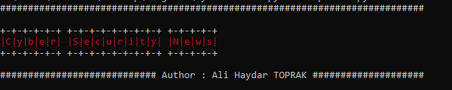
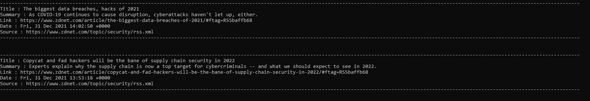

# Cyber Security News

### Description

CyberSecNews is a small code block where you can follow daily cybersecurity news.

### Requirements

- python3
- pip

### How to Works ?

- Clone or Download Repo
- Run __pip install -r requirements.txt__ or __pip3 install -r requirements.txt__
- Run "reporter.py" (__python reporter.py__) or (__python3 reporter.py__)

### Example Results

